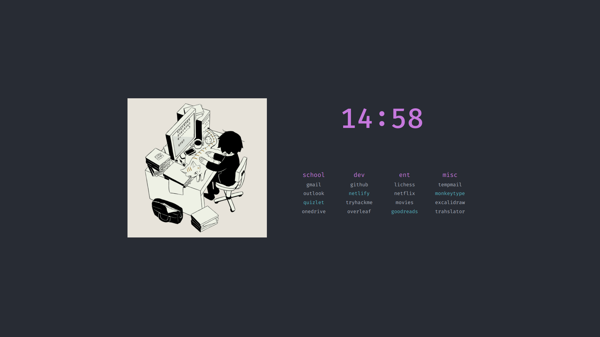

# startpage

Custom browser startpage with colors inspired by the [One Dark syntax theme](https://github.com/atom/atom/tree/master/packages/one-dark-syntax) for the [Atom text editor](https://atom.io).

Forked from https://github.com/kencx/startpage.git and added time module and changed the colorscheme.

## Preview
[Live Preview](https://michaelneuper.github.io/startpage/)

## Usage
- Clone this repo or download the `.zip`
- Go to browser settings and choose custom homepage
- Copy and paste the file path to the `index.html` file

## Modifying
Change the:
- _timezone_ in line 5 in `script.js`
- _locale_ in line 13 in `script.js`
- _font_ in line 12 in `styles.css`
- _links_ in `index.html`
- _colors_ in `styles.css`
  - Color reference:
  

- _picture_ in `index.html` from the [cat gif](https://twitter.com/avogado6/status/1165595520967954432?s=19)
